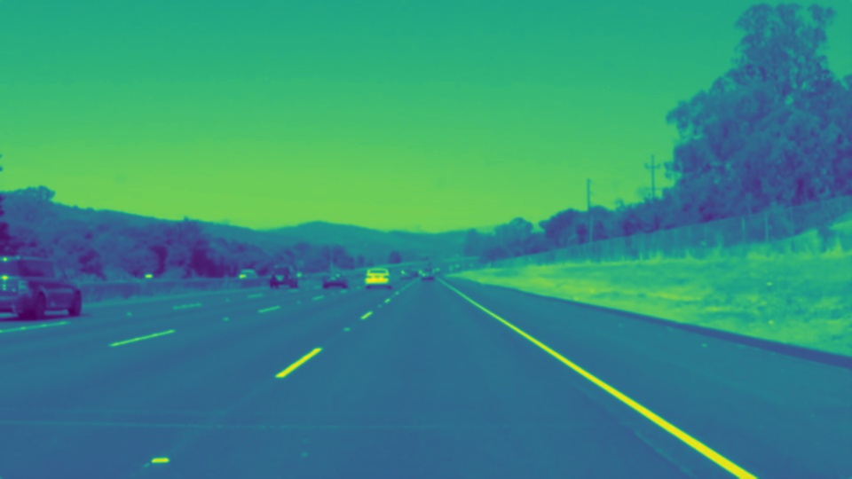

# **Finding Lane Lines on the Road** 

---

### Reflection

## 1. My pipeline

My pipeline consisted of 5 steps. First, I converted the images to grayscale, applied gaussian blur,

canny edge detection, image mask, then hough line transformation. 

In order to draw a single line on the left and right lanes, I modified the draw_lines() function. 

For each hough line, I assigned them to either left or right lane group, by their gradient. 

[grey_scale]: ./processed/grey_scale.jpg "Grayscale"
[gaussian]: ./processed/gaussian.jpg "Gaussian"
[Edge detection and ROI mask]: ./processed/roi.jpg "Edge detection and roi"

For the optional challenge, the biggest obstacle was that the front hood of the car was in the video,

interfering with lane detection. I first thought of removing bottom part of the video, but it led to 

performance drop for other videos. For the submission, I set a gradient magnitude limit of 0.5 to remove

edges caused by the front hood, which made the pipe line more robust.

<figure>
  
  <figcaption>Fig1. Grayscaled image</figcaption>
</figure>
<figure>
  
  <figcaption>Fig2. Image after applying gaussian blur</figcaption>
</figure>
<figure>
  
  <figcaption>Fig3. Extracted lane.</figcaption>
</figure>

## 2. Identify potential shortcomings with your current pipeline

One potential shortcoming would be that it may malfunction on extremely sharp curves,

due to its gradient limit.

## 3. Suggest possible improvements to your pipeline

A possible improvement would be to recalibrate the camera on start-up.

Analyze the scene before driving and adjust the camera angle to optimal position.

After that we can remove the gradient limit.

